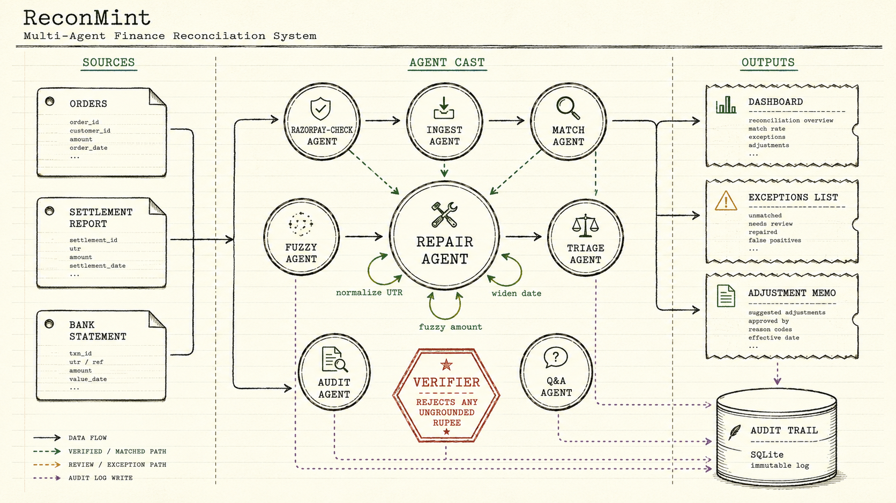

# ReconMint

**An AI Finance Controller agent for the books and the cash.** Solo submission to the **Razorpay AI Buildathon 2026 · Track 4**.

<!--  -->

Every Indian merchant on Razorpay lives with three ledgers that never quite agree: their orders, Razorpay's settlement report, and their bank statement. Fees, GST, TCS, T+2 timing, chargebacks. All of it drifts. Most merchants still reconcile it by hand in a spreadsheet, once a month, after the fact.

ReconMint is an **agent that runs the loop for them.** Seven sub-agents cooperate on the batch. Each one owns a decision, branches per record, and writes its reasoning to an audit table. The LLM is on a short leash: it can parse a question and phrase an answer, but a verifier vetoes any rupee it can't ground in the audit trail.

**The AI never touches a number it can't prove.** That's the whole product.

<!--  -->

---

## Try it in 30 seconds

```bash
git clone https://github.com/pradhanashwarya2122/reconmint.git
cd reconmint
pip install -r requirements.txt
cd frontend && npm install && cd ..
cp .env.example .env         # add OPENAI_API_KEY (Razorpay test keys optional)

python -m uvicorn backend.api.main:app --port 8000   # terminal 1
cd frontend && npm run dev                           # terminal 2
```

Open `http://localhost:5173`, click **Try sample data**. The Upload page will show every agent lighting up in real time.

---

## The agent cast

Not a pipeline. A **cast of small agents**, each with one job and the authority to branch on what it sees.



**Repair Agent is the interesting one.** For every unmatched record it tries three rescue strategies in order (normalize UTR, widen date window, tight fuzzy scoring). First strategy to clear 85% confidence wins. Every attempt is written to `strategy_attempts_json` per record. Open any exception's **Decisions** tab and you see the actual tree for that specific payment: which strategy was tried, what it scored, what it decided, why.

That per-record branching is why this is an agent, not a pipeline.

---

## What each agent does

- **Razorpay-check Agent** hits `api.razorpay.com` at ingest, captures HTTP status + latency + `X-Razorpay-Request-Id`, and confirms schema fidelity live. If keys are missing it says so instead of pretending.
- **Ingest Agent** reads CSV or Excel, detects header rows through preamble, fuzzy-maps 60+ common column aliases to the canonical schema, synthesizes optional columns as zero when absent.
- **Match Agent** reconstructs the fee schedule (MDR + GST-on-MDR + TCS) from gross, then joins on UTR + paise-exact amount + same IST day.
- **Fuzzy Agent** re-scores what Match missed with an amount-bucket index (kept it near-linear at scale).
- **Repair Agent** does per-record branching. Three strategies, first-wins, full audit of attempts.
- **Triage Agent** routes what's left: auto-resolve / explain / escalate. Every record visited exactly once, never loops.
- **Audit Agent** writes 20+ columns per decision to SQLite. Every rupee on any dashboard traces back here.
- **Q&A Agent** parses intent, picks the deterministic tool, computes, verifies, phrases. The verifier can reject the LLM's answer if any rupee doesn't ground; the deterministic answer is used instead.

---

## Why it's not just a matcher

**Bounded LLM.** The AI parses your question and writes the sentence. That's it. Every number in the sentence is computed in Python, then magnitude-checked by the verifier before you see it.

**Verifier veto.** If the LLM invents a figure (or gets one out by a paisa), the verifier catches it and swaps in the deterministic answer. Tested in `tests/test_verifier.py` with fabricated numbers, near-misses, and sign flips.

**Injection-safe.** The LLM never sees raw file text. It sees pre-computed numbers only. A file can't smuggle instructions.

**Full audit trail.** Every decision, every fuzzy score, every LLM call with its cost, latency, and verifier verdict, all in SQLite. `make eval` reads from it. So does the Dashboard. So does Ask.

---

## Metrics (from `make eval`)

| Metric | Value | Notes |
|---|---|---|
| Match rate (exact + fuzzy) | **97.68%** | 512 active settlements |
| Reconciled rate | **94.78%** | fully tied order↔settlement↔bank, fee-validated |
| Throughput (small batch) | **~12,700 rec/s** | 500 records in 0.40s |
| Stress benchmark | **149,250 rows in 217s** | 687 rec/s sustained |
| Exception detection F1 | **0.93** | TP 31 · FP 5 · FN 0 |
| False negatives | **0** | never misses real money |
| Q&A routing / grounding | **10/10 · 10/10** | on seed set |
| AI cost per explanation | **~$0.00007** | on-demand, capped, verifier-gated |
| Razorpay schema fidelity | **7/11 exact** | validated live against test API |

Recall pinned to 1.0 by choice: the five false positives are all sub-paise GST rounding a human clears in seconds. I'd rather flag five clean rows than miss one real overcharge. Documented in `config.py` with the exact reasoning.

---

## Features (short list)

**Upload page.** Three drop-zones, per-file validation, and the agent cockpit that lights up cell by cell while the run happens. Below that, a **Decision Ledger** streams the real per-record verdicts the agents wrote to SQLite.

**Dashboard.** Three tabs. **Cash** carries the four-bucket **Cash Position** (Cleared / In-flight / At-risk / Ghost) with Net Available, plus a dual-direction **Cash Timeline** (past cleared landings + future T+2 projections), **Tax Exposure** (MDR / GST / TCS drift), and **Fee Slab · revenue advice** (compares your effective MDR against Razorpay's published slabs). **Reconciliation** carries the breakdown, Repair Agent activity, fee composition, and source-file viewer. **Audit** carries Detection Accuracy (demo) or Quality Signals A/B/C/D (uploads) and AI cost.

**Live Razorpay card.** Always visible above the tabs. Blue, pulsing, expandable. HTTP status, latency, request-id, three real orders from your test account, verbatim.

**Exceptions page.** Severity tabs, search, drawer with five tabs (Overview / Diagnose & Fix / Ledger / Decisions / Explain). The **Decisions** tab shows the Repair Agent tree for that specific payment. Resolve emits an **adjustment memo** as JSON + printable HTML.

**Ask the agent.** Spartan input box. Streaming trace shows the four steps (understand → compute → verify → phrase). Every answer carries a green Verified tick. Click **Prove it** to see the fifteen `pay_XXX` ids behind the number.

**CFO Brief.** One click, print-ready one-pager: Net Available, cash buckets, 7-day forecast, top three exceptions, tax exposure. Save as PDF from the browser.

---

## The engine (money math)

- **Integer paise everywhere.** No floats near money.
- **IST-normalized dates.** Monday settlement + Wednesday bank credit still compares as T+2.
- **Independent fee reconstruction.** Every settlement's expected net is recomputed from `gross − MDR − GST-on-MDR − TCS − refund − chargeback`. If the bank credit matched but the net was wrong, it's still flagged.
- **Materiality threshold** on fee gaps: `max(a few paise, 0.05% of gross)`. Real overcharges are 0.4-1.2% of gross, so this doesn't hurt recall but stops sub-paise rounding artifacts flooding the exception list.

---

## Data + validation

`backend/generator/generate.py` emits `orders.csv`, `settlement.csv`, `bank.csv`, plus a hidden `answer_key.csv` with ground-truth categories. The matcher never sees the key; the eval harness scores against it.

The settlement schema is modelled field-for-field on the real Razorpay API, validated by `scripts/razorpay_probe.py` against live test-mode Orders. Test mode doesn't emit multi-day settlement files (needs live activation and real payout cycles), so ReconMint **generates** a batch whose **field shapes are real** while **volume and timing are synthetic and disclosed.** Full validation table in `docs/razorpay_validation.md`.

---

## Reproduce every number

```bash
python scripts/run_eval.py       # match rate + precision/recall/F1
python scripts/eval_qa.py        # Q&A agent routing + grounding
python scripts/benchmark.py      # throughput at 500 / 2k / 10k / 50k
python scripts/razorpay_probe.py # live schema check
make test                        # verifier + engine tests
```

---

## Repo layout

```
backend/
  agent/          seven agents + LLM client + hallucination verifier + audit trail
  api/            FastAPI endpoints + Pydantic models
  engine/         loader, matcher, fuzzy pass, fee reconstruction
  eval/           ground-truth harness (F1 on demo)
  generator/      synthetic dataset generator
frontend/         React + Vite, ledger-paper aesthetic
scripts/          stress benchmark, live probe, evals
tests/            verifier + engine
docs/             Razorpay validation notes
FAILURES.md       every bug that hit me, hand-written
```

---

## Track 4 alignment

Reading the brief line by line, this is what I built for each phrase:

- *"Run the books."* Three-way reconciliation with integer paise, independent fee reconstruction, full SQLite audit.
- *"And the cash position."* Four-bucket Cash Position card with a Net Available headline, sourced from this run's audited decisions.
- *"AI agent that closes one finance-ops loop."* Resolve an exception, get back an adjustment memo (JSON + printable HTML) with a simulated ERP webhook payload. That's the loop closing.
- *"50+ record batches."* 149,250 rows in 217s on the stress benchmark. 500 records in 0.4s.
- *"Match rate."* Live headline strip, mutually-exclusive stacked breakdown, per-strategy Repair Agent hit rates.
- *"Exceptions it could not resolve."* Full Exceptions table, nothing hidden, resolution reasons and notes persisted per row.
- *"Verification, not generation."* Hallucination verifier magnitude-checks every rupee an LLM writes. Rejects → deterministic answer used.

Four directions the brief suggested, all shipped in the same agent:

- **Multi-source reconciliation** → Match + Fuzzy + Repair (three strategies per unmatched record).
- **Settlement Q&A agent** → Ask page with the parse → compute → verify → phrase loop.
- **Forward cash forecaster** → dual-direction Cash Timeline, T+2 projection, past-due surfacing.
- **Tax-line matcher** → MDR / GST / TCS observed vs expected with recover / reserve exposure.

---

## A note on the build

I keep [FAILURES.md](FAILURES.md) open in a tab while I work. Every real bug goes in it the day it breaks. The float-rupee drift on day one. The verifier that was too strict and rejected correct explanations on day seven. The O(n²) fuzzy pass I only caught with a stress benchmark. The Repair Agent that scaled cubically until I built the amount + normalized-UTR indexes. The Railway 500 from `requests` missing in `requirements.txt`. Each entry: symptom, root cause, fix, lesson.

I'd previously built Polynous, a multi-agent research system. The agent scaffolding here wasn't accidental; it's how I default to thinking about problems where small components need to disagree and vote.
