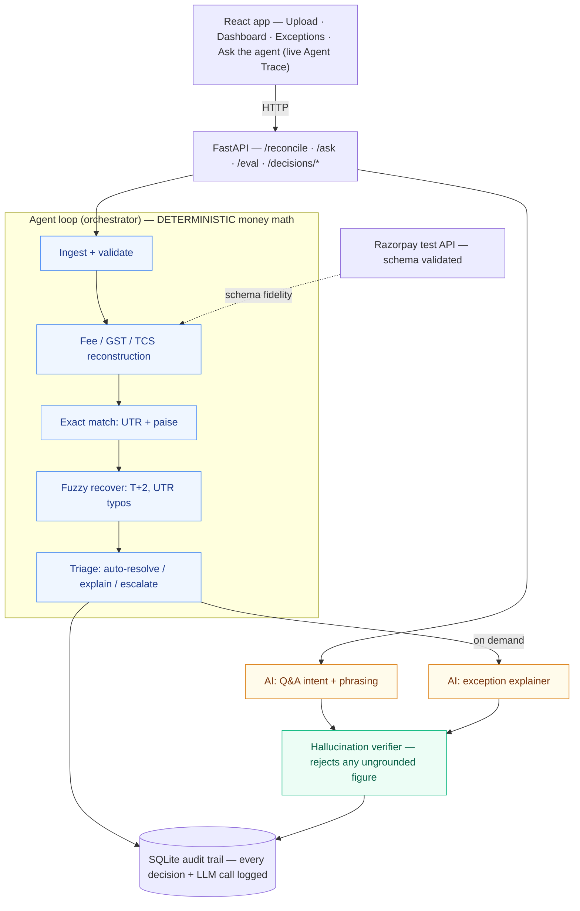

# ReconMint

> **A verification agent for money.** ReconMint reconciles a Razorpay merchant's settlements three
> ways, and it can prove every number it reports — it refuses to state a figure it can't ground in
> computed data. Ask it anything about a settlement and it answers in plain English, but it never
> invents a rupee.

Built for the **Razorpay AI Buildathon — Track 4 (AI Finance Controller)**. Solo. It covers two of
the named directions in one product — **multi-source reconciliation** and a **settlement Q&A agent** —
and it's built around Track 4's own thesis: *verification, not generation, is the bottleneck.*

Most "AI for finance" demos point a language model at spreadsheets and hope. I did the opposite. In
ReconMint the money math is 100% deterministic and auditable, and the AI is kept on a short leash:
it reasons about *what* to compute and phrases the answer, but a verifier rejects any number it
can't trace back to a computed value. The result is an autonomous agent you can actually trust with
settlements.

---

## What it does

Drop in three files — an order ledger, a Razorpay settlement report, and a bank statement — and the
agent runs a bounded loop:

**ingest → reconstruct fees → exact match → fuzzy recover → triage → verify → log**

It reports a match rate, throughput, measured accuracy against a held-out answer key, and an honest
list of the records it could *not* resolve. Then you can open any exception to see exactly why it was
flagged, ask the agent questions in plain English, and export a reconciliation report.

---

## Architecture



**Blue is deterministic** — all matching, arithmetic, fee reconstruction, confidence scoring, triage
routing, and the stopping rule. **Amber is AI** — only intent-parsing and phrasing. **Green is the
verifier** that gates every AI figure. The LLM never touches the money math and never states a number
it can't prove.

---

## Features

### Upload — watch the agent work
- **Three-file intake** with client-side validation (CSV only, ≤50 MB), auto-categorisation by
  filename, per-file "valid" status, and a drag-or-browse dropzone.
- **"Try sample data"** runs the built-in synthetic batch instantly — nothing external to break.
- **Live reconciliation trace.** After you run it, the page doesn't just spin — it *replays the real
  reconcile pipeline* stage by stage (ingest & validate → fee reconstruction + exact match → fuzzy
  recovery → triage → verify & log). Each step shows its real measured latency and the real counts it
  produced (e.g. "470 matched on UTR + paise-exact amount"). This is data, not a scripted animation —
  the backend returns the trace and the UI plays it back. It's what makes ReconMint visibly an
  *agent*, not a pipeline.
- **Friendly errors.** A missing column produces "Bank Statement is missing required column 'utr'",
  not a stack trace.

### Dashboard — the run at a glance
- **Headline metrics:** reconciled rate, match rate (incl. fuzzy), records processed, processing
  time + throughput, total amount reconciled (in ₹ with Indian grouping), and exception count.
- **Cash position (Finance Controller view)** — four mutually-exclusive buckets computed
  from this run's audited decisions, plus a headline **Net Available** figure. The buckets are:
  - **Cleared** — reconciled settlements matched to a bank credit (money in your account).
  - **In-flight** — settlements Razorpay confirmed but the bank has not yet credited.
  - **At-risk** — chargebacks and disputed payments being clawed back.
  - **Ghost** — bank credits with no matching settlement (cash you have but can't attribute).
  Net Available = *cleared + ghost − at-risk*. In-flight is deliberately excluded so a controller
  sees what is actually spendable *right now*, not what's projected. Each bucket expands to show
  the payment IDs behind it. Fed by `GET /runs/{run_id}/cash-position`; every rupee traces to a
  row in the `decisions` table.
- **Forward cash forecast (next 3 / 7 / 14 / 30 days)** — every in-flight settlement is projected
  forward to `record_date + T+2 business days` (weekends skipped, holidays TBD). Rendered as a
  column chart with a `Today` marker in red. Three summary chips at the top: **In horizon**,
  **Past-due** (settlements that should have landed by now — a live "escalate now" list), and
  **Beyond horizon** (won't land within the selected window). Click any bar to see the payment IDs
  landing that day. Fed by `GET /runs/{run_id}/cash-forecast?horizon_days=N&t_plus=2`.
- **Repair Agent · per-record branching (agentic, not pipeline)** — every settlement that
  survives the exact + fuzzy passes is handed to a Repair Agent that tries three deterministic
  repair strategies in order, logs every attempt (score, verdict, latency, detail), and accepts
  the first strategy whose confidence clears threshold ≥ 0.85. The three strategies:
  **amount_utr_fuzzy** (tight standard fuzzy — logged as the control datum),
  **normalize_utr** (uppercase + strip punctuation, retry exact amount + UTR — catches
  formatting drift), and **widen_date_window** (paise-exact amount, extend T+ to ±7 days —
  catches late credits). The Dashboard has a "Repair Agent activity" card with per-strategy hit
  rates + recovery percentage + average attempts/record. Every attempt is persisted per-decision
  as `strategy_attempts_json`; the Exceptions drawer's new **Decisions** tab replays the tree
  for that specific record (verdict badges, score bars, "resolved via this" stamp on the winner).
- **Live Razorpay API verification (sponsor-product truth anchor)** — at ingest ReconMint makes
  a real HTTPS call to `api.razorpay.com` using your `RAZORPAY_KEY_ID` / `RAZORPAY_KEY_SECRET`,
  fetches up to 3 recent records from your test account, and renders the wire-level result on the
  Dashboard: HTTP status, latency, the URL that was hit, and the `X-Razorpay-Request-Id` header
  Razorpay stamps into every response (the id an auditor can quote back to Razorpay support to
  trace one call). If your test account has no payments yet, the client transparently falls back
  to `/v1/orders` — the truth-anchor a merchant creates first — and the card labels which source
  answered. If the API is unreachable or the keys are missing, that's surfaced honestly rather
  than hidden. Fed by `GET /runs/{run_id}/razorpay-verification`; also a live probe at
  `GET /razorpay/health`. Every reconcile trace now opens with a "Live Razorpay API handshake"
  stage.
- **Batch quality signals (grade A / B / C / D)** — for uploaded runs that have no ground-truth
  answer key, ReconMint publishes six *proxy* signals derivable from the audited decisions alone:
  cross-source coverage, fee-schedule adherence, triage certainty, fuzzy match quality,
  duplicates handled, input integrity. Each carries an A/B/C/D grade; a composite score is
  weighted from the four percentage signals. This replaces the pretend precision/recall you'd
  get from measuring against data you generated. Fed by `GET /runs/{run_id}/quality-signals`.
- **Adjustment memo (closes the finance-ops loop)** — resolving an exception now generates a
  downstream artifact in two formats: (1) a machine-readable JSON payload at
  `GET /decisions/{decision_id}/adjustment-memo` (with a simulated webhook payload the payer's
  ERP/ops queue could consume), and (2) a print-ready HTML memo at
  `GET /decisions/{decision_id}/adjustment-memo.html` that opens in a new tab and can be saved
  as PDF from the browser. The `resolution_reason` maps to a downstream action:
  *confirmed → audit-trail*, *override → post_journal_entry*, *false_positive → close_and_ignore*,
  *escalated → route_to_ops_queue*.
- **Tax-line matcher (Tax exposure this batch)** — a first-class panel that reads the audited
  fee reconstruction and surfaces three tax lines with observed-vs-expected drift:
  - **MDR** — observed % of gross vs expected 2.00%
  - **GST on MDR** — observed % of MDR vs expected 18.00%
  - **TCS** — observed % of gross vs expected 1.00%

  A headline **exposure** figure shows what the merchant should investigate:
  *over-charged* (recover from gateway) vs *under-charged* (reserve to pay back), with a per-record
  anomaly table ranked by |variance|, filterable by direction. When every rupee matches the
  Razorpay schedule to the paise the headline flips green ("Tax lines clean"). Fed by
  `GET /runs/{run_id}/tax-exposure`; every anomaly links to a `pay_XXX` present in the
  Exceptions list.
- **Detection Accuracy card** — precision / recall / F1 measured against a hidden answer key, plus
  the honest false-positive and false-negative counts. (Shown on demo runs, which have ground truth.)
- **Reconciliation Breakdown** — a mutually-exclusive stacked bar: auto-matched, fuzzy-matched, fee
  anomalies, unresolved, duplicates, ghost credits.
- **Record Reconciliation Waterfall** — a bridge chart showing how the batch flows from ingested down
  to unresolved, with hover tooltips.
- **Fee Composition donut** — where the money went across the batch (MDR vs GST-on-MDR vs TCS vs
  refunds) with the total in the centre.
- **AI cost strip** — model, calls, verified count, and the exact dollar cost of the run's AI.
- **Source Files viewer** — an in-app spreadsheet preview (Settlement report / Bank statement / Order
  ledger tabs) with search and zoom, so you can inspect the raw rows the agent reconciled.
- **Report** button — one click generates a clean, printable reconciliation report (run summary,
  accuracy, fee composition, full exception list) and opens the print dialog for PDF. **Audit export**
  downloads every logged decision as CSV.

### Ask the agent — deliberately focused
The prompt box is a textarea, a send button, and one transparency chip that reads *"This run only ·
figures verified before sent"*. There are no attachment, voice-record, or mode-toggle buttons
because none of them would work here — the agent answers grounded questions about the loaded
reconciliation run, nothing else, and the UI reflects that honestly.

### Exceptions — review what needs a human
- **Severity tabs** (All / Critical / Warning / Info) with live counts, **search by payment ID**, and
  pagination.
- **Rich table:** payment ID, date, amount, category (Amount Mismatch / Missing in Bank / Chargeback
  / Duplicate), a colour-coded severity dot, match method, confidence, and status.
- **Detail drawer** on any row:
  - a **ledger** (computed vs bank) with the real fee lines — gross, MDR, GST-on-MDR, TCS — and the
    variance,
  - a **fee-bridge waterfall** visualising gross → net with the variance highlighted,
  - a **"verified against N computed figures"** banner,
  - an **AI explanation on demand** — click "Explain with AI" and the agent generates a plain-English
    explanation that's verified before it's shown (it falls back to the deterministic explanation if
    the model tries to introduce an unverifiable number),
  - a **Diagnose & Fix** tab with a per-category investigation checklist that persists across
    sessions — tick two steps, close the drawer, reload the page, the ticks are still there.
    Server-side storage via `POST /decisions/{id}/checklist`; the header carries a "Persisted"
    (or "Saving…") chip so the state is visible, not implied.
  - **Mark as Resolved**, which removes the item from the queue.
- **"View source data"** toggle opens the same spreadsheet viewer so you can cross-reference an
  exception against the raw settlement / bank rows.

### Ask the agent — conversational, and honest
- Ask questions in plain English ("how much did fees eat this batch?", "which payments are missing in
  bank?", "explain pay_00010XX").
- The agent runs a **bounded loop** you can watch in the **Agent Trace**: understand intent → choose a
  deterministic tool → compute → verify → answer. Every figure carries a green "verified" tick.
- If a figure can't be grounded, the trace shows a **"caught — answered from computed data"** step —
  the model's phrasing is rejected and the grounded answer is used instead.
- Seed questions are provided so a reviewer can start immediately.

---

## The engine (how the money math works)

- **Integer paise everywhere.** All amounts are carried and compared as integer paise, so there is no
  floating-point drift — ₹0.01 errors can't cascade through fee arithmetic.
- **IST-normalised dates.** Every date is parsed to Asia/Kolkata, so a settlement dated Monday and a
  bank credit dated Wednesday (a normal T+2 lag) are compared correctly.
- **Fee reconstruction.** For each settlement, ReconMint independently recomputes the expected net
  from `gross − MDR − GST-on-MDR − TCS − refund − chargeback` and checks it against what Razorpay
  reported. A settlement whose bank credit matched but whose net is *wrong* is still flagged — because
  the money that landed was the wrong amount.
- **Exact match first, fuzzy second.** Exact matching joins on UTR + paise-exact amount + same IST
  day. What's left is retried with a tolerant, scored pass (±₹1 amount gate, T+0..T+3 window, UTR
  similarity) that recovers timing lags and transposed-digit UTRs — each with a confidence score, so a
  fuzzy match never masquerades as a certain one. An amount-bucket index keeps this near-linear at
  scale.
- **Deterministic triage + a stopping rule.** Every record is visited once and routed to
  auto-resolve, explain, or escalate. Unresolvable records (genuine ghost credits, chargebacks with no
  credit) are escalated — the agent never loops on them.

## Guardrails

- **Hallucination verifier.** Every rupee figure in an AI answer or explanation is checked against the
  set of computed magnitudes for that record; anything ungrounded is rejected and the deterministic
  answer is used instead. (Tested in `tests/test_verifier.py`.)
- **Injection-safe.** The LLM is only ever handed pre-computed numbers, never raw file text, so file
  contents can't smuggle in instructions. CSV export is neutralised against formula injection.
- **Full audit trail.** Every run and every per-record decision — match method, confidence, resolution,
  triage action, and any LLM call with its cost, latency, and verifier verdict — is written to SQLite
  and is queryable.

---

## Metrics (measured, from a real batch run — `make eval`)

| Metric | Value | Notes |
|---|---|---|
| Match rate (exact + fuzzy) | **97.68%** | on 512 active settlements |
| Reconciled rate | **94.78%** | fully tied order↔settlement↔bank, fee-validated |
| Throughput | **~12,700 rec/s** (0.12s) | 500-record target < 4s: **PASS** (0.40s) |
| Exception detection — Precision | **0.86** | of flagged, how many were real |
| Exception detection — Recall | **1.00** | of real problems, how many caught |
| Exception detection — F1 | **0.93** | TP = 31 · FP = 5 · FN = 0 |
| False-positive cost | **5** | all sub-paise GST rounding; 0 real money missed |
| Exceptions (honest list) | **42** | 19 critical · 23 warning |
| Q&A agent | **10/10** routing, **10/10** grounded | on the seed question set |
| AI cost | **~$0.00007 / explanation** | on demand, capped, verifier-gated |
| Razorpay schema fidelity | **7/11 exact** | validated against the live test API |

I keep the recall at 1.0 deliberately — the tool never misses real money — and I'm honest that this
costs a little precision: the five false positives are all sub-paise GST rounding, which a human
clears in seconds. That trade-off is a choice, and it's documented rather than hidden.

---

## Validated against the live Razorpay test API

The synthetic `settlement.csv` is modelled field-for-field on the **real** Razorpay API, not invented.
`scripts/razorpay_probe.py` creates real test-mode Orders and captures the live schema:

- **Live contact confirmed** — real Orders created (e.g. `order_TTqoMt4WLQVfAn`), 10 order fields
  confirmed live.
- **Schema fidelity: 7/11 exact** field matches, 3 close mappings, 1 explicit gap
  (`gross↔amount`, `mdr_fee↔fee`, `gst_on_mdr↔tax`, `net_settled↔settlement.amount`,
  `settlement_utr↔settlement.utr`, …). Full table in `docs/razorpay_validation.md`.
- **What's real vs generated:** test mode doesn't emit rich multi-day settlement files (settlements
  need live activation and real payout cycles), so ReconMint *generates* a batch whose **field shapes
  are real** while the **volume and multi-day timing are synthetic — and disclosed**. `tcs` is modelled
  explicitly because it's marketplace/Route-specific, not a standard payment field.

---

## Quickstart

Run the full app (backend + UI):
```bash
pip install -r requirements.txt
cp .env.example .env                    # add OPENAI_API_KEY (+ optional RAZORPAY test keys)
python backend/generator/generate.py    # seed synthetic data (520 records + hidden answer key)
uvicorn backend.api.main:app --port 8000
```
```bash
cd frontend && npm install && npm run dev   # open http://localhost:5173
```
Then click **Try sample data (demo)** to watch the agent reconcile live, or open **Ask the agent**.

Reproduce every number from the command line:
```bash
python scripts/run_eval.py       # match rate + precision/recall/F1 + honest error list
python scripts/eval_qa.py        # Q&A agent routing + grounding accuracy
python scripts/benchmark.py      # throughput / memory at 500 / 2k / 10k records
python scripts/razorpay_probe.py # validate the schema against the live Razorpay test API
make test                        # verifier + engine tests
```

## Data

`backend/generator/generate.py` emits `orders.csv`, `settlement.csv`, `bank.csv`, and a hidden
`answer_key.csv` with ground-truth categories (clean, fee_explained, partial_refund, chargeback,
timing_t2, duplicate, transposed_utr, ghost_bank, fee_anomaly, rounding_noise). The matcher never
sees the answer key — the eval harness scores against it.

## Performance

| Records | Rows | Time | Throughput | Peak mem |
|--------:|-----:|-----:|-----------:|---------:|
| 500 | 1,494 | 0.40s | 3,687 rec/s | 1.2 MB |
| 2,000 | 5,968 | 1.67s | 3,582 rec/s | 3.8 MB |
| 10,000 | 29,844 | 13.9s | 2,152 rec/s | 18.4 MB |

Near-linear scaling after I indexed the fuzzy pass by amount bucket (it was O(n²) before — see
`FAILURES.md`).

## Tests

`tests/test_verifier.py` (the hallucination guard) and `tests/test_engine.py` (end-to-end engine +
validation). Run with `make test`.

---

## A note on the build

I keep a running `FAILURES.md` of what actually broke and how I got out of it — the floating-point
rupee drift, the T+2 date-bucketing, the verifier that was *too* strict and rejected correct
explanations, and the O(n²) fuzzy pass. I'd previously built Polynous, a multi-agent research system,
so the agent scaffolding here was a deliberate design choice rather than something I stumbled into.
