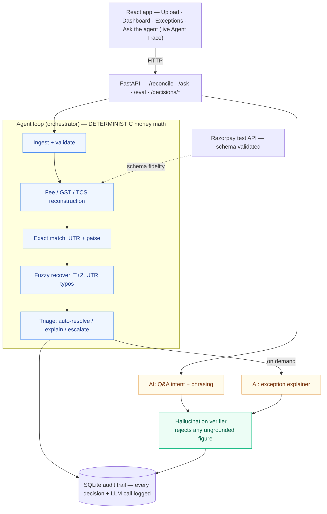

# ReconMint

> **A verification agent for money.** It reconciles a Razorpay merchant's settlements three ways,
> and it can prove every number it reports — refusing to state a figure it can't ground in computed
> data. Ask it anything about a settlement; it answers in plain English but never invents a rupee.

Razorpay AI Buildathon — **Track 4 (AI Finance Controller)**. Solo build. Covers two of the named
directions: **multi-source reconciliation** + **settlement Q&A agent**. The thesis is Track 4's
own: *verification, not generation, is the bottleneck.*

## What it does
An autonomous agent ingests an order ledger, a Razorpay settlement report, and a bank statement,
then runs a bounded loop — **plan → match → fuzzy-recover → triage → verify** — reporting a match
rate, throughput, measured accuracy, and an honest list of what it could not resolve. Money math is
deterministic and audited; the LLM only reasons and phrases, gated by a hallucination verifier.

## Architecture



**Blue = deterministic** (all matching, arithmetic, fee reconstruction, confidence, triage, the
stopping rule). **Amber = AI** (only intent-parsing and phrasing). **Green = the verifier** that
gates every AI figure. The LLM never touches the money math and never states a number it can't prove.

## Metrics (measured, from a real batch run — `make eval`)

| Metric | Value | Notes |
|---|---|---|
| Match rate (exact + fuzzy) | **97.68%** | on 512 active settlements |
| Reconciled rate | **94.78%** | fully tied order↔settlement↔bank, fee-validated |
| Throughput | **~12,700 rec/s** (0.12s) | 500-record target < 4s: **PASS** (0.40s) |
| Exception detection — Precision | **0.86** | of flagged, how many were real |
| Exception detection — Recall | **1.00** | of real problems, how many caught |
| Exception detection — F1 | **0.93** | TP=31 · FP=5 · FN=0 |
| False-positive cost | **5** | all sub-paise GST rounding, 0 missed money |
| Exceptions (honest list) | **42** | 19 critical · 23 warning |
| Q&A agent | **10/10** routing, **10/10** grounded | on the seed question set |
| AI cost | **~$0.00007 / explanation** | on-demand, capped, verifier-gated |
| Razorpay schema fidelity | **7/11 exact** | validated against the live test API |

## AI vs deterministic — the judgment call
Reconciliation math is **100% deterministic**: it runs in integer paise, joins on UTR + amount with
explicit IST date windows, and reconstructs every fee, because money math must be reproducible and
auditable — an LLM has no business doing it. The LLM is confined to two jobs where language is the
point: turning a question into a structured intent, and phrasing an explanation. Even there it is on
a leash — the **hallucination verifier rejects any figure not present in the computed data**, and the
agent falls back to the grounded deterministic answer. That is the whole product: *an AI you can
trust with money because it cannot fabricate a number.*

> **Proof of shipping:** built solo by the author of [Polynous](https://github.com), a multi-agent
> research system — so the agent scaffolding here is deliberate, not accidental.

## Quickstart

Run the full app (backend + UI):
```bash
pip install -r requirements.txt
cp .env.example .env                    # add OPENAI_API_KEY (+ optional RAZORPAY test keys)
python backend/generator/generate.py    # seed synthetic data (520 records + hidden answer key)
uvicorn backend.api.main:app --port 8000
```
```bash
cd frontend && npm install && npm run dev   # open http://localhost:5173
```
Then click **Try sample data (demo)** to watch the agent reconcile live, or **Ask the agent**.

Headless (CLI) — reproduce every number:
```bash
python scripts/run_eval.py              # match rate + precision/recall/F1 + honest error list
python scripts/eval_qa.py               # Q&A agent routing + grounding accuracy
python scripts/benchmark.py             # throughput / memory at 500 / 2k / 10k records
python scripts/razorpay_probe.py        # validate the schema against the live Razorpay test API
make test                               # verifier + engine tests
```

## Data
`backend/generator/generate.py` emits `orders.csv`, `settlement.csv`, `bank.csv`, and a hidden
`answer_key.csv` with ground-truth categories (clean, fee_explained, partial_refund, chargeback,
timing_t2, duplicate, transposed_utr, ghost_bank). The matcher never sees the answer key; the
eval harness scores against it.

## Status
- [x] Day 1 — scaffold + synthetic generator (520 records) + FAILURES.md
- [x] Day 2 — deterministic exact matcher (91% exact match rate, paise-exact + IST dates)
- [x] Day 3 — fee/GST/TCS reconstruction (460 fee-reconciled, 10/10 fee anomalies caught, 0 false positives)
- [x] Day 4 — fuzzy matching + confidence (97.67% match rate, 34 near-misses recovered, 0 false matches)
- [x] Day 5 — eval harness + metrics (precision 0.86 / recall 1.0 / F1 0.93 on exception detection; honest FP list; confusion matrix; eval_results.json)
- [x] Day 6 — agent loop + exception triage + SQLite audit trail (532 decisions logged & queryable; deterministic triage; stopping rule)
- [x] Day 7 — LLM exception explainer + hallucination verifier (grounded explanations, model-switchable, verifier rejects fabricated figures, ~$0.00007/call)
- [x] Day 8a — FastAPI layer (/health, /reconcile, /reconcile/demo, /runs/{id}, /exceptions, /audit-export; Pydantic models; friendly errors; severity counts) — see FRONTEND_SPEC.md
- [x] Day 8b — React app (Vite): Upload + Dashboard + Exceptions integrated, wired to the live API, real numbers, on-demand AI explanations, verified in-browser
- [x] Phase 1 — Settlement Q&A agent (`/ask`): structured-intent routing + deterministic compute + verifier-gated phrasing + live Agent Trace; 10/10 routing, 10/10 grounded (2nd named direction covered)
- [x] Phase 1b — Agent visibility: live reconcile Agent Trace on Upload (real per-stage latencies) + "Autonomous agent" framing
- [x] Phase 2 — Razorpay test-API validation: real Orders created, schema 7/11 exact (`docs/razorpay_validation.md`)
- [x] Phase 3 — Premium README: one-liner + mermaid architecture (AI vs deterministic) + measured metrics table + rationale — CLEAN PASS complete
- [x] Phase 5 — Richer viz + report: per-exception fee-waterfall (drawer), batch fee-composition donut (dashboard), one-click printable reconciliation report
- [ ] Day 9 — Razorpay test-key schema validation + polish

## Validated against the live Razorpay test API
ReconMint's synthetic `settlement.csv` is modeled field-for-field on the **real** Razorpay API, not
invented. `scripts/razorpay_probe.py` creates real test-mode Orders and captures the live schema:

- **Live contact confirmed** — created real Orders (e.g. `order_TTqoMt4WLQVfAn`), 10 order fields
  confirmed live (`amount`, `amount_paid`, `amount_due`, `status`, `receipt`, ...).
- **Schema fidelity: 7/11 exact** field matches, 3 close mappings, 1 explicit gap
  (`gross↔amount`, `mdr_fee↔fee`, `gst_on_mdr↔tax`, `net_settled↔settlement.amount`,
  `settlement_utr↔settlement.utr`, ...). Full table in `docs/razorpay_validation.md`.
- **Honesty note:** test mode does not emit rich multi-day settlement files (settlements need live
  activation + real payout cycles), so ReconMint *generates* a batch whose **field shapes are real**
  (validated here) while the **volume/timing are synthetic and disclosed**. `tcs` is modeled
  explicitly (marketplace/Route-specific, not a standard payment field).

```bash
python scripts/razorpay_probe.py
```

## Performance (make bench)
| Records | Rows | Time | Throughput | Peak mem |
|--------:|-----:|-----:|-----------:|---------:|
| 500 | 1,494 | 0.40s | 3,687 rec/s | 1.2 MB |
| 2,000 | 5,968 | 1.67s | 3,582 rec/s | 3.8 MB |
| 10,000 | 29,844 | 13.9s | 2,152 rec/s | 18.4 MB |

Target (500 records < 4s): PASS. Near-linear scaling after amount-bucket indexing of the fuzzy pass.

## Tests (make test)
`tests/test_verifier.py` (hallucination guard) and `tests/test_engine.py` (end-to-end engine +
validation) - 8 tests, all passing.

See `FAILURES.md` for the running "what broke" log.
